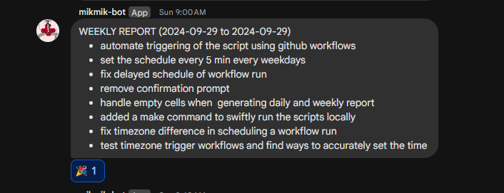

# auto-sheet-gen-bot

## Overview
The auto-sheet-gen-bot is an automated system designed to generate weekly summaries from Google Sheets data and facilitate reporting through a bot notification system. Built using a combination of shell scripting and GitHub Actions, this project streamlines data management and enhances communication efficiency.

## Key Features
- **Data Retrieval:** Utilizes Google Sheets API to fetch data from specified sheets and ranges, ensuring timely access to necessary information.
- **Automated Summary Generation:** Employs the Gemini AI model to generate concise summaries of the fetched data, presenting them in a clear and organized format.
- **Notifications:** Sends automated notifications to a designated bot channel whenever summaries are generated or data files are emptied, keeping stakeholders informed.
- **Scheduled Execution:** Integrates with GitHub Actions to run scheduled tasks, allowing for regular updates without manual intervention. Users can also manually trigger workflows as needed.

## Technology Stack
- **Languages:** Shell scripting for automation
- **APIs:** Google Sheets API for data access; Gemini API for content generation
- **CI/CD:** GitHub Actions for continuous integration and automated workflows

## Use Case
Ideal for teams and organizations that require consistent reporting and data analysis, the AutoSheet Gen Bot simplifies the process of summarizing data and enhances productivity by automating routine tasks.

Daily Report

Weekly Report

